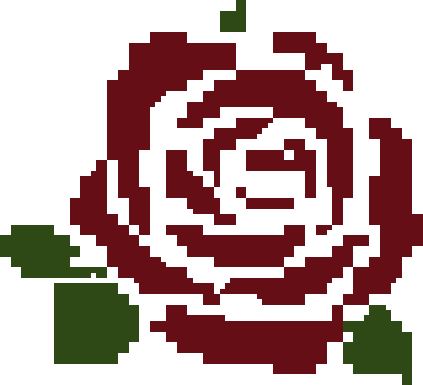

# Project: B612

> *진짜로 중요한 것은 눈에 보이지 않아. 마음으로 봐야만 진정으로 볼 수 있지.*
 

## 💫B612 행성으로부터의 초대
안녕하세요, 의뢰인님.
 
해결단 "장미"에 오신 걸 환영합니다. 사무실이 조금 어수선하지만... 혹시 도와주시겠어요?
 
 
저희가 관리하던 *감정의 별*이 사무실 곳곳에 흩어져버렸습니다. 다양한 부정적인 감정이 응축되어 생성된 별이죠. 의뢰인님께서 찾아주신다면, 저희가 각자의 힘으로 정화해드릴 수 있을 거에요.
  
정리가 끝나는 대로 의뢰인님의 고민을 들어드리겠습니다.
 
부디, 저희를 도와주시기를 바라며 기다리고 있을게요.
  
*어린왕자 드림*

 

## 🌹해결단, 장미
> *"의뢰인님이 전달해주신 별들은, 해결사 각자의 힘을 이용해 새로운 별로 탄생할 거에요."*
 

여러분은 B612 행성에 존재하는 해결단, *장미*의 고객이 되어 고민을 해결하고자 그들의 사무실에 도착했습니다.
 
하지만 왜인지 사무실 안은 어수선한데요...?
  

> *저희가 각각 관리하는 감정의 별이 흩어져 있는 상태입니다.*

그들이 관리하는 **감정의 별**이 그만 흩어져버렸다고 합니다.
 
흩어져있는 별들은 모두 정화가 필요한 **부정적인 감정의 별**이라고 하는데...
 
 
왜인지 모르겠지만 여러분의 눈에는 별들의 위치가 훤히 보이고 있습니다.
 
결국 어딘가 모르게 허술한 그들을 도와 사무실 구석구석에 숨어있는 감정의 별을 찾아, 각 단원에게 전달해주기로 합니다.
 

 

## ⭐감정의 별, 의뢰
> *"이제 얼추 정리가 된 것 같군요. 다시 한 번 '장미'의 단정으로서 감사드립니다. 그렇다면 이제 의뢰를 받아볼까요?"*
 

감정의 별을 모두 찾아 각 단원들에게 전달한 당신.
 
어린왕자는 그런 당신에게 드디어 의뢰를 들어주겠다 합니다.
  
> 의뢰 접수 확인서와 선물을 보냈습니다.

마음 깊숙한 곳에 남몰래 가지고 있던 고민을 적고 원하는 단원을 같이 선택하면, 고민에 대한 답변을 받을 수 있습니다.
 
단원의 성격이 정말 잘 드러나는 답변과 함께, 선물도 함께 왔는데요?

 

## 🐾별을 찾아가는 길
[Project: B612](https://b612-blue.vercel.app)
 
위 주소를 통해, 해결단 *장미*에 방문할 수 있습니다.

 

## 🛠️장미의 구성 요소
해결단 *장미*는 아래와 같은 요소로 구성되어있어요.

### 🖥️FE : [최승혁](https://github.com/qwerasdfxzdcv)

 

### 📟BE : [이현숙](https://github.com/platinum57)

### 🪄Tools & DevOps

  
  

> *"모든 어른들은 처음엔 어린이였지만, 그걸 기억하는 어른은 거의 없어."*  
> *"어른들은 스스로는 아무것도 이해하지 못해. 아이들은 늘 설명에 지쳐 버리지."*  
> *"네가 오후 4시에 온다면, 나는 3시부터 행복해지기 시작할 거야."*
